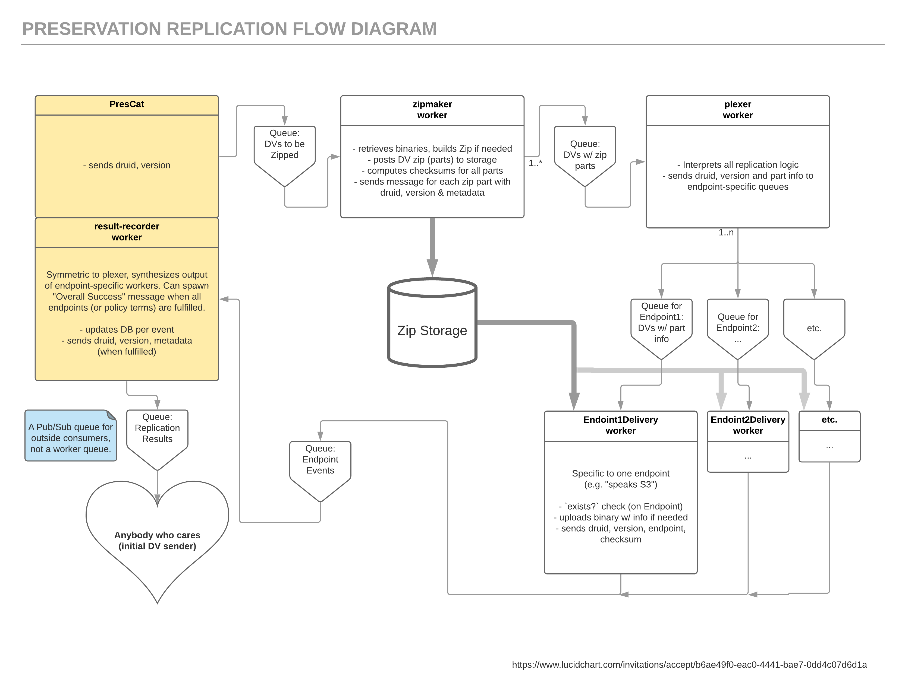

### A brief explanation of the replication queue

Basically just notes from an infrastructure team knowledge transfer meeting for Pres Cat...

_Note: This is only an explanation of the replication flow, since the other workers are relatively straightforward, and don't hand off jobs to other workers._

Much of the replication happens automatically via ActiveRecord hooks -- e.g. when a CompleteMoab is created, the associated records for the ZippedMoabVersions are automatically created. Upon creation of those records, a job is queued for each so that the zip file for each version eventually gets created. After that, each worker calls the next worker in the chain upon success (ZipmakerJob -> PlexerJob -> [AwsEastDeliveryJob, AwsWestDeliveryJob, IbmSouthDeliveryJob] -> ResultsRecorderJob).

The worker that makes zips and the workers that do delivery are intentionally designed to not need the DB. Though they are Rails workers in the Pres Cat app at the moment, we could rewrite them in something else in another codebase later, if we felt that would be more performant (and worth the effort). Plexer and ResultsRecorder must query and update the DB, and so have to know about it.

In general, all work that happens via a queue takes a variable (possibly long) amount of time, and/or is failure prone and benefits from retries, and/or is a chokepoint at which a further step is gated.

The above was generated from this Lucid Chart diagram: https://www.lucidchart.com/documents/edit/d680072f-68e3-4644-91d3-4f20a3fdcd12/0
