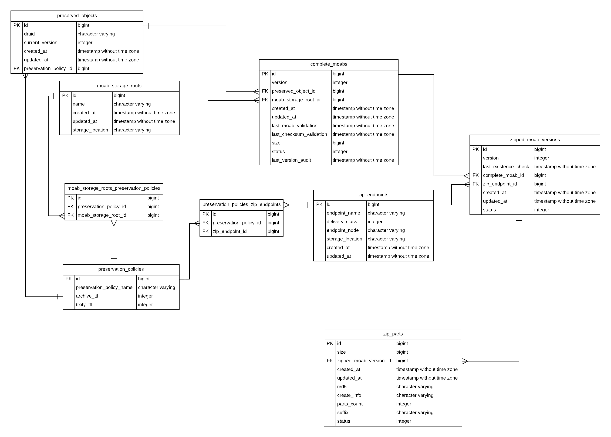

### schema explanation (as of 2017-12-14)

##### Schema Entity-Relationship Diagram


<sub>Diagram generated from lucidchart.com (File > Import Data > Entity Relationship > SQL Import > PostgreSQL; follow instructions for schema dump/import, arrange tables given on left-hand toolbar)</sub>

###### Key:
* <sub>The diagram is generated from a Postgres schema dump, so the tables are listed by their SQL names.  Each SQL table has a corresponding ActiveRecord class, whose name is a camel case version of the snake case SQL name (with one exception, explained below).  The explanation tries to use the SQL table name or the ActiveRecord classname according to which is most appropriate, and may be arbitrary when either would suffice.</sub>
* <sub>`FK` in the diagram indicates a [foreign key](https://en.wikipedia.org/wiki/Foreign_key) constraint on that column to a row in another table.</sub>
* <sub>`PK` in the diagram indicates the [primary key](https://en.wikipedia.org/wiki/Unique_key#Defining_primary_keys_in_SQL) column for the table.</sub>
* <sub>The cross side of the connection between tables indictates a required foreign key relationship, or what ActiveRecord would call `belongs_to` (with a `null: false` constraint on the column definition and a corresponding `presence: true` on the ActiveRecord class definition).  In our current data model, none of our foreign key reference fields may be null.  Each such ActiveRecord object must point to exactly one instance of its foreign key referent.</sub>
  * <sub>E.g., a row in `complete_moabs` (retrievable as a `CompleteMoab` ActiveRecord object) must point to (`belong_to`) exactly one row in `preserved_objects` (a `PreservedObject`).</sub>
* <sub>The fork side of the connection between tables indicates a one to zero or more relationship, or what ActiveRecord calls `has_many`.</sub>
  * <sub> E.g., a row in `zip_parts` (a `ZipPart`) may have many corresponding rows in `zipped_moab_version` (retrievable as `ZippedMoabVersion` objects).
* <sub>We have one thin "join table", `moab_storage_roots_preservation_policies`, which has no corresponding ActiveRecord class.  ActiveRecord is made aware of the mapping between the `moab_storage_roots` and `preservation_policies` tables by way of `has_and_belongs_to_many` relationship declarations o `moab_storage_root` (to `preservation_policies`) and `PreservationPolicy` (to `moab_storage_roots`).</sub>
  * <sub>Semantically, the idea is that a moab_storage_root may be used by more than one preservation policy, and a preservation policy may be implemented by multiple moab_storage_roots.  Typically, this sort of many-to-many relationship is expressed in a relational database schema by way of an intermediary table that maps related rows in the two tables.  This is more structured and easier to query/update than, e.g., a list field on a row in one table enumerating all the related row IDs in the other table.</sub>

#### What do these table rows (ActiveRecord objects) represent in the "real" world?  (a list of the ActiveRecord subclasses, and a (non-exhaustive) list of their fields)
* A `PreservedObject` represents the master record for a `complete_moab_object` as well as the `zipped_moab_version` that we intend to preserve. It also holds some high level summary info that applies to all of the related complete moabs.
  * `druid` is the digital resource unique identifier
  * `current_version` is current latest version we've seen for the druid across all instances.
  * `preservation_policy_id` points to the policy governing how the object should be preserved.
* A `CompleteMoab` represents a physical copy of a `PreservedObject`, e.g. a moab (represents all versions) stored on premesis and accessed via NFS mount, the `zipped_moab_vesion` (represents a single version) copy sitting on a cloud endpoint (manipulable via REST calls to a 3rd party cloud service), etc.
  * `size`: is approximate, and given in bytes.  It's intended to be used for things like allocating storage.  It should _not_ be treated as an exact value for fixity checking.
  * `status`: a high-level summary of the copy's current state.  This is just a reflection of what we last saw on disk, and does not capture history, nor does it necessarily enumerate all errors for a copy that needs remediation.
  * `version`: should be the same as `PreservedObject` current version. This is left over from when `complete_moab` and `zipped_moab_version` shared a table.
* An `MoabStorageRoot` represents a physical storage location on which a `CompleteMoab` resides.  E.g., a single NFS-mounted storage root for `complete_moabs`, or a single bucket from a cloud service holding `zipped_moab_versions`.  The `MoabStorageRoot` fields include info about:
  * `storage_location`: the path or bucket name or similar from which to read (e.g. "/services-disk03/sdr2objects", "sdr-bucket-01", etc).
  * `preservation_policies`: the preservation policies for which governed objects are preserved (declared to ActiveRecord via `has_and_belongs_to_many :preservation_policies`).
* A `PreservationPolicy` defines
  * `moab_storage_roots`: the endpoints to which the objects governed by the policy should preserved (declared to ActiveRecord via `has_and_belongs_to_many :moab_storage_root`).
  * `archive_ttl`: the frequency with which the existence of the appropriate archive copies should be checked.
  * `fixity_ttl`: the frequency with which the online copies should be checked for fixity.
* `ZipEndpoint` represents the endpoint where the `zipped_moab_version` will be replicated to.
  * `endpoint_name`: the human readable name of the endpoint (e.g. `aws_s3_us_east_1`)
  * `delivery_class`: the name of the class that does the delivery (e.g `S3WestDeliveryJob`)
  * `endpoint_node`: the network location of the endpoint relative to the preservation catalog instance (e.g. localhost for a locally mounted NFS volume, s3.us-east-2.amazonaws.com for a S3 bucket, etc).
  * `storage_location`: the bucket name (e.g. `sul-sdr-aws-us-east-1-test`)
* `ZippedMoabVersion` corresponds to a Moab-Version on a `ZipEndpoint`.
  * `version`: the version from the Moab that was zipped.
  * `last_existence_check` represents the last time the Moab-Version existed on a ZipEndpoint
  * `complete_moab_id`: references the parent complete moab on disk.
  * `zip_endpoint_id`: the endpoint on which the Moab-Version has been replicated
  * `status`: represents whether `ZippedMoabVersion` has been replicated, needs to be replicated, or remediated.
* `ZipParts`: We chunk archives of Moab versions into multiple files greater than 10GBs. This represents metadata for one such part.
  * `size` represents the size of the actual `zip_part`
  * `zipped_moab_version_id` references the parent Moab-Version on a `ZipEndpoint`. 99% of the time, we will have 1 `ZippedMoabVersion` to 1 `ZipPart`.
  * `md5` represents the checksum used for checksum validation
  * `create_info` is a hash containing the zip command and zip version.
  * `parts_count` displays how many total zip parts were created during replication.
  * `suffix` if there is 1 `ZipPart` suffix will always be `.zip` if there are more than 1 `ZipPart` the suffix will be `.z01` through `.z(n-1)` (e.g. 3 parts will be ['.z01', '.z02', '.zip'])
  * `status`: displays whether the `ZipPart` has been replicated or not.

#### other terminology
* An "online" copy is an exploded moab folder structure, on which we can run structural verification or checksum verification for constituent files, and from which we can retrieve individual assets of the moab.
* An "archive" copy corresponds to a Moab-Version on a `ZipEndpoint`. The format is a multipart zip upload.
* "TTL" is an acronym for "time-to-live", or an expiry age.  In the case of our `archive_ttl` and `fixity_ttl` values, it's the age beyond which we consider the last archive or fixity check result to be stale (in which case those checks should be re-run at the next scheduled opportunity).


### how to use transactions appropriately

The Rails API docs: http://api.rubyonrails.org/classes/ActiveRecord/Transactions/ClassMethods.html

General advice:
* Please use `ApplicationRecord.transaction` for clarity and consistency.
  * Functionally, it doesn't matter whether `.transaction` is called on a specific ActiveRecord class or object instance, because the transaction applies to the database connection, and all updates in a given thread of operation will be going over the same database connection (it is possible to configure ActiveRecord to do otherwise, but like most applications, we don't).  To reduce confusion, it seems best to just always invoke it via the super-class, so that it's clear that the transaction applies to all object types being grouped under it.
* If two or more things should fail or succeed together atomically, they should be wrapped in a transaction.  E.g. if you're creating a PreservedObject so that there's a master record for the CompleteMoab that you'd like to create, those two things should probably be grouped as a transaction so that if the creation of the CompleteMoab fails, the creation of the PreservedObject gets rolled back, and we don't have a stray lying around.
* Don't wrap more things than needed in a transaction.  If multiple operations can succeed or fail independently, it's both semantically incorrect and needlessly inefficient to group them in a transaction.
  * Likewise, try not to do too much extra processing in the `Application.transaction` block.  It's fine to wrap nested chains of method calls in a transaction, as it might be a pain to decompose your code such that the transaction block literally only contained ActiveRecord operations.  At the same time, the longer a transaction is open, the higher the chances that two different updates will try to update the same thing, possibly causing one of the updates to fail.  So, if it's easy to keep something unnecessary out of the transaction block, it'd be wise to do so.
* In the unlikely event that you're tempted to pro-actively do row-locking, e.g. due to concern about multiple processes updating a shared resource (e.g. if multiple processes were crawling the same storage root and doing moab validation), the Postgres docs seems to advise against that.  Instead, specifying transaction isolation level seems to be recommended as the more robust and performant approach.
  * Isolation level can be passed as a param to the transaction block, e.g. `ApplicationRecord.transaction(isolation: :serializable) { ... }`
  * `serializable` is the strictest isolation level: https://www.postgresql.org/docs/current/static/transaction-iso.html
    * relevant Rails API doc: http://api.rubyonrails.org/classes/ActiveRecord/ConnectionAdapters/DatabaseStatements.html#method-i-transaction
    * more background and advice from the PG wiki: https://wiki.postgresql.org/wiki/Serializable
  * If there is actually little contention in practice, the PG docs seem to indicate that specifying isolation level, even something as strict as `serializable`, should have little to no overhead (though it could increase chances of failed updates if there is actual resource contention, though code should already be prepared to handle failed DB updates gracefully).  As such, there seems to be little risk to erring on the side of a strong isolation level when in doubt.
  * *probably shouldn't* do it this way: http://api.rubyonrails.org/classes/ActiveRecord/Locking/Pessimistic.html
* You should likely be catching ActiveRecord exceptions outside of the transaction block, as you likely want to abort the transaction after the first ActiveRecord exception anyway.  In other words, wrap transactions in exception handling, and not vice versa.  See "Exception handling and rolling back": http://api.rubyonrails.org/classes/ActiveRecord/Transactions/ClassMethods.html
* Use for ActiveRecord enums (http://edgeapi.rubyonrails.org/classes/ActiveRecord/Enum.html):
  * Instead of using plain string values everywhere, define class constants for the string values, and use those class constants both when defining the enum, and when referring to enum values in other parts of the codebase.
  * In the enum definition, explicitly map each enum string to its underlying integer value, and leave a note admonishing future developers not to change enums that are already in use in production (or to think about the needed migration).  This is to prevent unintentional re-mapping of existing enum values.
  * Example:  https://github.com/sul-dlss/preservation_catalog/blob/master/app/models/complete_moab.rb


### some useful ActiveRecord queries
* useful for running from console for now, similar to the sorts of info that might be exposed via REST calls as development proceeds
* things below related to status will change once status becomes a Rails enum on CompleteMoab (see #228)

#### which objects aren't in a good state?
```ruby
# example AR query
[25] pry(main)> CompleteMoab.joins(:preserved_object, :moab_storage_root).where.not(status: :ok).order('complete_moabs.status asc, moab_storage_roots.storage_location asc').pluck(:status, :storage_location, :druid)
```
```sql
-- example sql produced by above AR query
SELECT "complete_moabs"."status", "storage_location", "druid" FROM "complete_moabs"
INNER JOIN "preserved_objects" ON "preserved_objects"."id" = "complete_moabs"."preserved_object_id"
INNER JOIN "moab_storage_roots" ON "moab_storage_roots"."id" = "complete_moabs"."moab_storage_root_id"
WHERE ("complete_moabs"."status" != $1)
ORDER BY complete_moabs.status asc, moab_storage_roots.storage_location asc
```
```ruby
# example result, one bad object on disk 2
[["invalid_moab", "/storage_root2/storage_trunk", "ab123cd456"]]
```

#### catalog seeding just ran for the first time.  how long did it take to crawl each storage root, how many moabs does each have, what's the average moab size?
```ruby
# example AR query
[2] pry(main)> MoabStorageRoot.joins(:complete_moabs).group(:name).order('name asc').pluck(:name, 'min(complete_moabs.created_at)', 'max(complete_moabs.created_at)', '(max(complete_moabs.created_at)-min(complete_moabs.created_at))', 'count(complete_moabs.id)', 'round(avg(complete_moabs.size))')
```
```sql
-- example sql produced by above AR query
SELECT "moab_storage_roots"."name", min(complete_moabs.created_at), max(complete_moabs.created_at), (max(complete_moabs.created_at)-min(complete_moabs.created_at)), count(complete_moabs.id), round(avg(complete_moabs.size)) FROM "moab_storage_roots"
INNER JOIN "complete_moabs" ON "complete_moabs"."moab_storage_root_id" = "moab_storage_roots"."id"
GROUP BY "moab_storage_roots"."name"
ORDER BY name asc
```
```ruby
# example result when there's one storage root configured, would automatically list all if there were multiple
[["storage_root2", 2017-11-18 05:49:54 UTC, 2017-11-18 06:06:50 UTC, "00:16:55.845987", 9122, 0.3132092573e10]]
```

#### how many moabs on each storage root are `status != 'ok'`?
```ruby
# example AR query
[12] pry(main)> CompleteMoab.joins(:preserved_object, :moab_storage_root).where.not(status: 'ok').group(:status, :storage_location).order('complete_moabs.status asc, moab_storage_roots.storage_location asc').pluck('complete_moabs.status, moab_storage_roots.storage_location, count(preserved_objects.druid)')
```
```sql
-- example sql produced by above AR query
SELECT complete_moabs.status, moab_storage_roots.storage_location, count(preserved_objects.druid) FROM "complete_moabs"
INNER JOIN "preserved_objects" ON "preserved_objects"."id" = "complete_moabs"."preserved_object_id"
INNER JOIN "moab_storage_roots" ON "moab_storage_roots"."id" = "complete_moabs"."moab_storage_root_id"
WHERE ("complete_moabs"."status" != $1)
GROUP BY "complete_moabs"."status", "storage_location"
ORDER BY complete_moabs.status asc, moab_storage_roots.storage_location asc 
```
```ruby
# example result, some moabs that failed structural validation
[["invalid_moab", "/storage_root02/storage_trunk", 1],
 ["invalid_moab", "/storage_root03/storage_trunk", 412],
 ["invalid_moab", "/storage_root04/storage_trunk", 127],
 ["invalid_moab", "/storage_root05/storage_trunk", 72]]
```

#### view the druids on a given endpoint
- will return tons of results on prod
```ruby
input> CompleteMoab.joins(:preserved_object, :moab_storage_root).where(moab_storage_roots: {name: :fixture_sr1}).pluck('preserved_objects.druid')
```
```sql
-- example sql produced by above AR query
 SELECT preserved_objects.druid FROM "complete_moabs"
 INNER JOIN "preserved_objects" ON "preserved_objects"."id" = "complete_moabs"."preserved_object_id"
 INNER JOIN "moab_storage_roots" ON "moab_storage_roots"."id" = "complete_moabs"."moab_storage_root_id"
 WHERE "moab_storage_roots"."name" = $1  [["name", "fixture_sr1"]]
```
```ruby
# example result
["bp628nk4868", "dc048cw1328", "yy000yy0000"]
```
