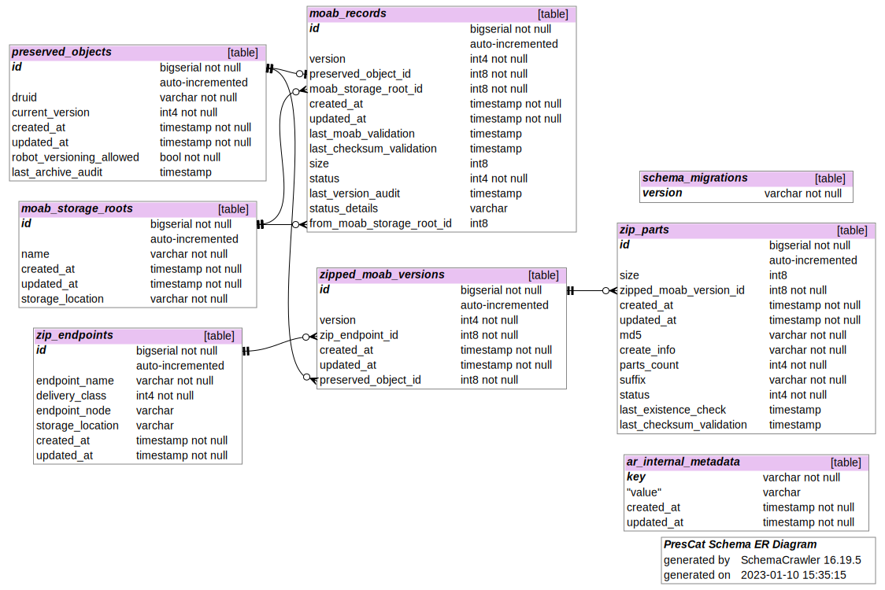

### Schema Explanation

##### Schema Entity-Relationship Diagram



_Please keep this up to date as the schema changes!_

To generate the updated ER diagram

- Make sure the `db` container is running, and that the `development` database has all migrations applied (`bin/rails db:create db:migrate`).
- Run `docker compose run --rm gen_er_diagram` from the project root.
- Commit the updated copy of `db/schema_er_diagram.svg`.

###### Key:

<details>
 <summary>How to read the ER diagram (expand for explanation)</summary>

- <sub>The diagram is generated by querying PostgreSQL directly, so the tables are listed by their SQL names. Each SQL table has a corresponding ActiveRecord class, whose name is a camel case version of the snake case SQL name (with one exception, explained below). The explanation tries to use the SQL table name or the ActiveRecord classname according to which is most appropriate, and may be arbitrary when either would suffice.</sub>
- <sub>The edges drawn between tables should align so that they connect a [foreign key](https://en.wikipedia.org/wiki/Foreign_key) column to the [primary key](https://en.wikipedia.org/wiki/Unique_key#Defining_primary_keys_in_SQL) column in the referent table.</sub>
- <sub>The cross side of the connection between tables indictates a required foreign key relationship (ActiveRecord's `belongs_to` with a `null: false` on the column definition and possibly a corresponding `presence: true` on the ActiveRecord class definition). In our current data model, none of our foreign key reference fields may be null. Each such ActiveRecord object must point to exactly one instance of its foreign key referent.</sub>
  - <sub>E.g., a row in `complete_moab` (retrievable as a `CompleteMoab` ActiveRecord object) must point to (`belong_to`) exactly one row in `preserved_objects` (a `PreservedObject`).</sub>
- <sub>The fork side of the connection between tables indicates a one to many relationship, (ActiveRecord's `has_many`).</sub>
  - <sub> E.g., a row in `zipped_moab_versions` (a `ZippedMoabVersion`) may have many corresponding rows in `zip_parts` (retrievable as `ZipPart` objects).</sub>
- <sub>The "o" at the end of a connection indicates there may be zero of the referent (e.g. there may not be any `zipped_moab_versions` yet for a new `zip_endpoints` entry).</sub>

- <sub>We have two thin "join tables", `moab_storage_roots_preservation_policies` and `preservation_policies_zip_endpoints`. They have no corresponding ActiveRecord classes. ActiveRecord is made aware of the mapping between the `moab_storage_roots` and `preservation_policies` tables by way of `has_and_belongs_to_many` relationship declarations -- on `MoabStorageRoot` (to `preservation_policies`) and `PreservationPolicy` (to `moab_storage_roots`). There are similar `has_and_belongs_to_many` declarations on `ZipEndpoint` and `PreservationPolicy` for that relationship.</sub>
  - <sub>Semantically, the idea is that a moab_storage_root may be used by more than one preservation policy, and a preservation policy may be implemented by multiple moab_storage_roots. Typically, this sort of many-to-many relationship is expressed in a relational database schema by way of an intermediary table that maps related rows in the two tables. This is more structured and easier to query/update than, e.g., a list field on a row in one table enumerating all the related row IDs in the other table.</sub>
  </details>

#### What do these table rows (ActiveRecord objects) represent in the "real" world? (a list of the ActiveRecord subclasses, and a (non-exhaustive) list of their fields)

- A `PreservedObject` represents the master record for a druid, tying together its `complete_moab` and `zipped_moab_versions`. It also holds some high level summary info.
  - `druid` is the digital resource unique identifier
  - `current_version` is current latest version we've seen for the druid.
  - `preservation_policy_id` points to the policy governing how the object should be preserved.
- A `CompleteMoab` represents a physical copy of a `PreservedObject`, stored on premises as a Moab (containing all versions for the druid) and accessed via Ceph mount. There is only one instance of `CompleteMoab` for a `PreservedObject` (= druid) across the storage roots. (Note: Ceph can be configured to store the one logical copy with some internal redundancy, without the need to expose that at the POSIX file system level.)
  - `size`: is approximate, and given in bytes. It's intended to be used for things like allocating storage. It should _not_ be treated as an exact value for fixity checking.
  - `status`: a high-level summary of the copy's current state. This is just a reflection of what we last saw on disk, and does not capture history, nor does it necessarily enumerate all errors for a copy that needs remediation.
  - `version`: should be the same as `PreservedObject` current version.
- A `MoabStorageRoot` represents a physical storage location (on premises) on which `CompleteMoabs` reside, e.g., a single Ceph or NFS mounted storage root. A `CompleteMoab` can only live on one `MoabStorageRoot` at a time, while a single `MoabStorageRoot` can store many `CompleteMoabs.`
  - `preservation_policies`: the preservation policies for which governed objects are preserved (`has_and_belongs_to_many :preservation_policies`).
- A `PreservationPolicy` defines
  - `moab_storage_roots`: the storage roots that are eligible to house the objects governed by the policy (`has_and_belongs_to_many :moab_storage_root`). At present, a `CompleteMoab` should only live on one `MoabStorageRoot` at a time.
  - `zip_endpoints`: the endpoints to which zipped versions of the Moab should be archived. In contrast to the storage roots, the a `ZippedMoabVersion` should live on _all_ `ZipEndpoints` that the policy maps to.
  - `archive_ttl`: the frequency with which the existence of the appropriate archive copies should be checked.
  - `fixity_ttl`: the frequency with which the online copies should be checked for fixity.
- `ZipEndpoint` represents an endpoint to which the `zipped_moab_version` is (or is being) replicated.
  - `endpoint_name`: the human readable name of the endpoint (e.g. `aws_s3_us_east_1`)
  - `delivery_class`: the name of the class that does the delivery (e.g `S3WestDeliveryJob`)
  - `endpoint_node`: the network location of the endpoint relative to the preservation catalog instance (e.g. localhost for a locally mounted NFS volume, s3.us-east-2.amazonaws.com for a S3 bucket, etc).
  - `storage_location`: the bucket name (e.g. `sul-sdr-aws-us-east-1-test`)
- `ZippedMoabVersion` corresponds to a Moab-Version archived as a zip file on a `ZipEndpoint`.
  - `version`: the version from the Moab for which this record tracks cloud archiving.
  - `preserved_object_id`: references the parent preserved object on disk.
  - `zip_endpoint_id`: the endpoint to which the Moab-Version has been replicated
- `ZipParts`: We chunk archives of Moab versions into segments. This represents metadata for one such part (we currently segment every [10 GB](https://github.com/sul-dlss/preservation_catalog/blob/162f0b487d4729072d68e42173322e1f5282ab50/app/models/druid_version_zip.rb#L167-L169), so most archive zips are only a single part).
  - `size` represents the size of the actual `zip_part`
  - `zipped_moab_version_id` references the parent Moab-Version on a `ZipEndpoint`. 99% of the time, we will have 1 `ZippedMoabVersion` to 1 `ZipPart`.
  - `md5` represents the checksum used for checksum validation
  - `create_info` is a hash containing the zip command invoked to create the parts and the version of the command.
  - `parts_count` displays how many total zip parts were created during replication (for this version on this endpoint).
  - `suffix` if there is 1 `ZipPart` suffix will always be `.zip`, if there are more than 1 `ZipPart` the suffix will be `.z01` through `.z(n-1)` (e.g. 3 parts will be ['.z01', '.z02', '.zip'])
  - `status`: displays whether the `ZipPart` has been replicated or not, whether there's an error with the cloud copy of the replicated part, etc.
  - `last_existence_check`: the last time we confirmed whether the part was still on cloud storage.
  - `last_checksum_validation`: the last time our stored checksum for the part was compared against the stored checksum on the cloud provider. Eventually we'd like this (or a separate but similar field) to denote an actual fixity check, where the copy is retrieved from the cloud and the checksum on the retrieved copy is compared to our stored checksum.
- `PreservedObjectsPrimaryMoab`: indicates the "primary" (and only) copy of a `CompleteMoab` for a `PreservedObject`. To be removed.

#### Other Terminology

- An "online" copy is an exploded Moab folder structure (on a POSIX file system), on which we can run structural verification or checksum verification for constituent files, and from which we can retrieve individual assets of the Moab.
- An "archive" copy corresponds to a Moab-Version on a `ZipEndpoint`. The format is a multipart zip upload.
- "TTL" is an acronym for "time-to-live", or an expiry age. In the case of our `archive_ttl` and `fixity_ttl` values, it's the age beyond which we consider the last archive or fixity check result to be stale (in which case those checks should be re-run at the next scheduled opportunity).

### Basic database advice / pres cat specific guidelines

Preservation Catalog uses PostgreSQL to store metadata about the last known state of all known copies of preserved SDR objects. It relies heavily on DB-level integrity constraints for keeping data consistent.

The Rails API docs: http://api.rubyonrails.org/classes/ActiveRecord/Transactions/ClassMethods.html

- If possible, avoid declaring a transaction explicitly, e.g. by updating a parent object and its children, declaring `autosave: true` on the parent for the child relationships, and calling `save` or `save!` on the parent object. ActiveRecord will implicitly perform this multi-level save in a transaction.
- Please use `ApplicationRecord.transaction` for clarity and consistency.
  - Functionally, it doesn't matter whether `.transaction` is called on a specific ActiveRecord class or object instance, because the transaction applies to the database connection, and all updates in a given thread of operation will be going over the same database connection (it is possible to configure ActiveRecord to do otherwise, but like most applications, we don't). To reduce confusion, it seems best to just always invoke it via the super-class, so that it's clear that the transaction applies to all object types being grouped under it.
- If two or more things should fail or succeed together atomically, they should be wrapped in a transaction. E.g. if you're creating a PreservedObject so that there's a master record for the CompleteMoab that you'd like to create, those two things should probably be grouped as a transaction so that if the creation of the CompleteMoab fails, the creation of the PreservedObject gets rolled back, and we don't have a stray lying around.
- Don't wrap more things than needed in a transaction. If multiple operations can succeed or fail independently, it's both semantically incorrect and needlessly inefficient to group them in a transaction.
  - Likewise, try not to do any unnecessary processing in the `Application.transaction` block. It's fine to wrap nested chains of method calls in a transaction, as it might be a pain to decompose your code such that the transaction block literally only contained ActiveRecord operations. At the same time, the longer a transaction is open, the higher the chances that two different updates will try to update the same thing, possibly causing one of the updates to fail. If it's easy to keep something unnecessary out of the transaction block, it'd be wise to do so.
- In the unlikely event that you're tempted to pro-actively do row-locking, e.g. due to concern about multiple processes updating a shared resource (e.g. if multiple processes were crawling the same storage root and doing moab validation), the Postgres docs seems to advise against that. Instead, specifying transaction isolation level seems to be recommended as the more robust and performant approach.
  - Isolation level can be passed as a param to the transaction block, e.g. `ApplicationRecord.transaction(isolation: :serializable) { ... }`
  - `serializable` is the strictest isolation level: https://www.postgresql.org/docs/current/static/transaction-iso.html
    - relevant Rails API doc: http://api.rubyonrails.org/classes/ActiveRecord/ConnectionAdapters/DatabaseStatements.html#method-i-transaction
    - more background and advice from the PG wiki: https://wiki.postgresql.org/wiki/Serializable
  - If there is actually little contention in practice, the PG docs seem to indicate that specifying isolation level, even something as strict as `serializable`, should have little to no overhead (though it could increase chances of failed updates if there is actual resource contention, though code should already be prepared to handle failed DB updates gracefully). As such, there seems to be little risk to erring on the side of a strong isolation level when in doubt.
  - E.g. you _probably shouldn't_ do it this way: http://api.rubyonrails.org/classes/ActiveRecord/Locking/Pessimistic.html
- You should likely be catching ActiveRecord exceptions outside of the transaction block, as you likely want to abort the transaction after the first ActiveRecord exception anyway. In other words, wrap transactions in exception handling, and not vice versa. See "Exception handling and rolling back": http://api.rubyonrails.org/classes/ActiveRecord/Transactions/ClassMethods.html
- Use of ActiveRecord enums (http://edgeapi.rubyonrails.org/classes/ActiveRecord/Enum.html):
  - In the enum definition, explicitly map each enum string to its underlying integer value, and leave a note admonishing future developers not to change enums that are already in use in production (or to think about the needed migration). This is to prevent unintentional re-mapping of existing enum values.
  - Example: https://github.com/sul-dlss/preservation_catalog/blob/main/app/models/complete_moab.rb

### Some useful ActiveRecord queries

- useful for running from console for now, similar to the sorts of info that might be exposed via REST calls as development proceeds
- things below related to status will change once status becomes a Rails enum on CompleteMoab (see #228)

#### note about sql sanitization

If running any of the following queries raises an error like:

```
ActiveRecord::UnknownAttributeReference: Query method called with non-attribute argument(s): "SUM(zip_parts.size) - max(complete_moabs.size) AS zmv_size_diff"
from /opt/app/pres/preservation_catalog/shared/bundle/ruby/2.7.0/gems/activerecord-6.1.3.2/lib/active_record/sanitization.rb:145:in `disallow_raw_sql!'
```

You may have to wrap the offending raw SQL in an `Arel.sql` call, e.g. `Arel.sql('SUM(zip_parts.size) - max(complete_moabs.size) AS zmv_size_diff')`.

per https://api.rubyonrails.org/classes/ActiveRecord/UnknownAttributeReference.html

> When working around this exception, caution should be taken to avoid SQL injection vulnerabilities when passing user-provided values to query methods. _Known-safe values_ can be passed to query methods by wrapping them in `Arel.sql`.  Again, _such a workaround should **not** be used when passing user-provided values_, such as request parameters or model attributes to query methods.

#### which objects aren't in a good state?

```ruby
# example AR query
[1] pry(main)> CompleteMoab.joins(:preserved_object, :moab_storage_root).where.not(status: 'ok').order(status: :asc, storage_location: :asc).pluck(:status, :storage_location, :druid)
```

<details>
 <summary>generated SQL</summary>

```sql
-- example sql produced by above AR query
SELECT "complete_moabs"."status", "storage_location", "druid" FROM "complete_moabs"
INNER JOIN "preserved_objects" ON "preserved_objects"."id" = "complete_moabs"."preserved_object_id"
INNER JOIN "moab_storage_roots" ON "moab_storage_roots"."id" = "complete_moabs"."moab_storage_root_id"
WHERE ("complete_moabs"."status" != $1)
ORDER BY complete_moabs.status ASC, moab_storage_roots.storage_location ASC
```

</details>

```ruby
# example result, one bad object on checksum_root01
[["invalid_checksum", "spec/fixtures/checksum_root01/sdr2objects", "zz102hs9687"]]
```

#### catalog seeding just ran for the first time. how long did it take to crawl each storage root, how many moabs does each have, what's the average moab size?

```ruby
# example AR query
[2] pry(main)> MoabStorageRoot.joins(:complete_moabs).group(:name).order('name asc').pluck(:name, Arel.sql('min(complete_moabs.created_at)'), Arel.sql('max(complete_moabs.created_at)'), Arel.sql('(max(complete_moabs.created_at)-min(complete_moabs.created_at))'), Arel.sql('count(complete_moabs.id)'), Arel.sql('round(avg(complete_moabs.size))'))
```

<details>
 <summary>generated SQL</summary>

```sql
-- example sql produced by above AR query
SELECT "moab_storage_roots"."name", min(complete_moabs.created_at), max(complete_moabs.created_at), (max(complete_moabs.created_at)-min(complete_moabs.created_at)), count(complete_moabs.id), round(avg(complete_moabs.size)) FROM "moab_storage_roots"
INNER JOIN "complete_moabs" ON "complete_moabs"."moab_storage_root_id" = "moab_storage_roots"."id"
GROUP BY "moab_storage_roots"."name"
ORDER BY name asc
```

</details>

```ruby
# example result when there's one storage root configured, would automatically list all if there were multiple
[["storage_root2", 2017-11-18 05:49:54 UTC, 2017-11-18 06:06:50 UTC, "00:16:55.845987", 9122, 0.3132092573e10]]
```

#### what's the breakdown of objects among the storage roots?

```ruby
# example AR query
[30] pry(main)> CompleteMoab.joins(:moab_storage_root).group(:status, :name, :storage_location).order(status: :asc, storage_location: :asc).pluck(:status, :name, :storage_location, 'count(complete_moabs.id)')
```

<details>
 <summary>generated SQL</summary>

```sql
-- example sql produced by above AR query
SELECT "complete_moabs"."status", "name", "storage_location", count(complete_moabs.id) FROM "complete_moabs"
INNER JOIN "moab_storage_roots" ON "moab_storage_roots"."id" = "complete_moabs"."moab_storage_root_id"
GROUP BY "complete_moabs"."status", "name", "storage_location"
ORDER BY "complete_moabs"."status" ASC, "storage_location" ASC
```

</details>

```ruby
# example result from stage
[["ok", "new-store-fixtures-sr1-last", "/services-disk-stage/new-store-fixtures-sr1/sdr2objects", 1],
 ["ok", "service-disk-stage100", "/services-disk-stage/store-100/sdr2objects", 3404],
 ["ok", "services-disk-stage2", "/services-disk-stage/store2/sdr2objects", 11229],
 ["ok", "fixture_sr2", "spec/fixtures/storage_root02/sdr2objects", 1],
 ["invalid_checksum", "fixture_sr3", "spec/fixtures/checksum_root01/sdr2objects", 10],
 ["invalid_checksum", "fixture_sr1", "spec/fixtures/storage_root01/sdr2objects", 1],
 ["invalid_checksum", "fixture_sr2", "spec/fixtures/storage_root02/sdr2objects", 2],
 ["validity_unknown", "fixture_sr1", "spec/fixtures/storage_root01/sdr2objects", 3]]
```

##### how many moabs on each storage root are `status != 'ok'`?

```ruby
# example AR query
[12] pry(main)> CompleteMoab.joins(:moab_storage_root).where.not(status: 'ok').group(:status, :name, :storage_location).order(status: :asc, storage_location: :asc).pluck(:status, :name, :storage_location, 'count(complete_moabs.id)')
```

<details>
 <summary>generated SQL</summary>

```sql
-- example sql produced by above AR query
SELECT "complete_moabs"."status", "name", "storage_location", count(complete_moabs.id) FROM "complete_moabs"
INNER JOIN "moab_storage_roots" ON "moab_storage_roots"."id" = "complete_moabs"."moab_storage_root_id"
WHERE "complete_moabs"."status" != 0
GROUP BY "complete_moabs"."status", "name", "storage_location"
ORDER BY "complete_moabs"."status" ASC, "storage_location" ASC
```

</details>

```ruby
# example result from stage
[["invalid_checksum", "fixture_sr3", "spec/fixtures/checksum_root01/sdr2objects", 10],
 ["invalid_checksum", "fixture_sr1", "spec/fixtures/storage_root01/sdr2objects", 1],
 ["invalid_checksum", "fixture_sr2", "spec/fixtures/storage_root02/sdr2objects", 2],
 ["validity_unknown", "fixture_sr1", "spec/fixtures/storage_root01/sdr2objects", 3]]
```

#### view the druids on a given endpoint

_Warning: will return **tons** of results on prod, query should probably be filtered further_

```ruby
# example AR query
input> CompleteMoab.joins(:preserved_object, :moab_storage_root).where(moab_storage_roots: {name: :fixture_sr1}).pluck('preserved_objects.druid')
```

<details>
 <summary>generated SQL</summary>

```sql
-- example sql produced by above AR query
 SELECT preserved_objects.druid FROM "complete_moabs"
 INNER JOIN "preserved_objects" ON "preserved_objects"."id" = "complete_moabs"."preserved_object_id"
 INNER JOIN "moab_storage_roots" ON "moab_storage_roots"."id" = "complete_moabs"."moab_storage_root_id"
 WHERE "moab_storage_roots"."name" = $1  [["name", "fixture_sr1"]]
```

</details>

```ruby
# example result
["bp628nk4868", "dc048cw1328", "yy000yy0000"]
```

#### view the zip parts for a given druid list

```ruby
# example AR query
input> druids = ["fj470sr8766", "ys375hy4998", "vx705zc3288"]
input> ZipPart.joins(
          zipped_moab_version: [:preserved_object, :zip_endpoint]
        ).where(
          preserved_objects: { druid: druids }
        ).order(
          :druid, :zip_version, :endpoint_name, :suffix
        ).pluck(
          :druid, 'current_version AS highest_version', 'zipped_moab_versions.version AS zip_version', :endpoint_name, :status, :suffix, :parts_count, :size, :created_at, :updated_at
        )
```

<details>
 <summary>generated SQL</summary>

```sql
-- example sql produced by above AR query
SELECT "druid", current_version AS highest_version, zipped_moab_versions.version AS zip_version,
  "endpoint_name", "zip_parts"."status", "zip_parts"."suffix", "zip_parts"."parts_count", "zip_parts"."size",
  "zip_parts"."created_at", "zip_parts"."updated_at"
FROM "zip_parts"
  INNER JOIN "zipped_moab_versions" ON "zipped_moab_versions"."id" = "zip_parts"."zipped_moab_version_id"
  INNER JOIN "preserved_objects" ON "preserved_objects"."id" = "zipped_moab_versions"."preserved_object_id"
  INNER JOIN "zip_endpoints" ON "zip_endpoints"."id" = "zipped_moab_versions"."zip_endpoint_id"
WHERE "preserved_objects"."druid" IN ('hz813rj6000', 'yg036yy3673', 'tb692bc8422', 'bg731fx0119', 'zx893sy6257', 'nx552zw5634', 'cd763sd8878', 'qc430zq6785', 'tg286cg3956', 'qt215kg7513')
ORDER BY "druid" ASC, "zip_version" ASC, "endpoint_name" ASC, "zip_parts"."suffix" ASC
```

</details>

```ruby
# example result
[["fj470sr8766", 4, 1, "aws_s3_east_1", "ok", ".zip", 1, 55793674, Sun, 06 Oct 2019 21:22:22 UTC +00:00, Wed, 15 Jul 2020 08:21:00 UTC +00:00],
 ["fj470sr8766", 4, 1, "aws_s3_west_2", "ok", ".zip", 1, 55793674, Sat, 11 Aug 2018 05:29:45 UTC +00:00, Wed, 15 Jul 2020 07:49:58 UTC +00:00],
 ["fj470sr8766", 4, 1, "ibm_us_south", "ok", ".zip", 1, 55793674, Sat, 09 Mar 2019 02:51:39 UTC +00:00, Wed, 15 Jul 2020 08:03:19 UTC +00:00],
 ["fj470sr8766", 4, 2, "aws_s3_east_1", "ok", ".zip", 1, 27729, Sun, 06 Oct 2019 21:22:17 UTC +00:00, Wed, 15 Jul 2020 08:21:01 UTC +00:00],
 ["fj470sr8766", 4, 2, "aws_s3_west_2", "ok", ".zip", 1, 27729, Sat, 11 Aug 2018 05:29:45 UTC +00:00, Wed, 15 Jul 2020 07:49:58 UTC +00:00],
 ["fj470sr8766", 4, 2, "ibm_us_south", "ok", ".zip", 1, 27729, Sat, 09 Mar 2019 02:51:38 UTC +00:00, Wed, 15 Jul 2020 08:03:19 UTC +00:00],
 ["fj470sr8766", 4, 3, "aws_s3_east_1", "ok", ".zip", 1, 35404, Sun, 06 Oct 2019 21:22:17 UTC +00:00, Wed, 15 Jul 2020 08:21:01 UTC +00:00],
 ["fj470sr8766", 4, 3, "aws_s3_west_2", "ok", ".zip", 1, 35404, Sat, 11 Aug 2018 05:29:45 UTC +00:00, Wed, 15 Jul 2020 07:49:58 UTC +00:00],
 ["fj470sr8766", 4, 3, "ibm_us_south", "ok", ".zip", 1, 35404, Sat, 09 Mar 2019 02:51:38 UTC +00:00, Wed, 15 Jul 2020 08:03:19 UTC +00:00],
 ["fj470sr8766", 4, 4, "aws_s3_east_1", "ok", ".zip", 1, 54801, Sun, 06 Oct 2019 21:22:22 UTC +00:00, Wed, 15 Jul 2020 08:21:01 UTC +00:00],
 ["fj470sr8766", 4, 4, "aws_s3_west_2", "ok", ".zip", 1, 54801, Thu, 09 May 2019 22:34:03 UTC +00:00, Wed, 15 Jul 2020 07:49:59 UTC +00:00],
 ["fj470sr8766", 4, 4, "ibm_us_south", "ok", ".zip", 1, 54801, Thu, 09 May 2019 22:34:03 UTC +00:00, Wed, 15 Jul 2020 08:03:19 UTC +00:00],
 ["vx705zc3288", 6, 1, "aws_s3_east_1", "ok", ".zip", 1, 103251, Mon, 18 Nov 2019 23:31:16 UTC +00:00, Fri, 17 Apr 2020 01:04:26 UTC +00:00],
 ["vx705zc3288", 6, 1, "aws_s3_west_2", "ok", ".zip", 1, 103251, Sun, 26 Aug 2018 05:36:26 UTC +00:00, Thu, 16 Apr 2020 11:07:52 UTC +00:00],
 ["vx705zc3288", 6, 1, "ibm_us_south", "ok", ".zip", 1, 103251, Fri, 08 Mar 2019 18:46:00 UTC +00:00, Thu, 16 Apr 2020 16:11:13 UTC +00:00],
 ["vx705zc3288", 6, 2, "aws_s3_east_1", "ok", ".zip", 1, 32635, Mon, 18 Nov 2019 23:31:16 UTC +00:00, Fri, 17 Apr 2020 01:04:26 UTC +00:00],
 ["vx705zc3288", 6, 2, "aws_s3_west_2", "ok", ".zip", 1, 32635, Sun, 26 Aug 2018 05:36:26 UTC +00:00, Thu, 16 Apr 2020 11:07:52 UTC +00:00],
 ["vx705zc3288", 6, 2, "ibm_us_south", "ok", ".zip", 1, 32635, Fri, 08 Mar 2019 18:46:00 UTC +00:00, Thu, 16 Apr 2020 16:11:13 UTC +00:00],
 ["vx705zc3288", 6, 3, "aws_s3_east_1", "ok", ".zip", 1, 40159, Mon, 18 Nov 2019 23:31:16 UTC +00:00, Fri, 17 Apr 2020 01:04:26 UTC +00:00],
 ["vx705zc3288", 6, 3, "aws_s3_west_2", "ok", ".zip", 1, 40159, Sun, 26 Aug 2018 05:36:26 UTC +00:00, Thu, 16 Apr 2020 11:07:53 UTC +00:00],
 ["vx705zc3288", 6, 3, "ibm_us_south", "ok", ".zip", 1, 40159, Fri, 08 Mar 2019 18:46:00 UTC +00:00, Thu, 16 Apr 2020 16:11:13 UTC +00:00],
 ["vx705zc3288", 6, 4, "aws_s3_east_1", "ok", ".zip", 1, 50144, Wed, 18 Mar 2020 05:00:55 UTC +00:00, Fri, 17 Apr 2020 01:04:26 UTC +00:00],
 ["vx705zc3288", 6, 4, "aws_s3_west_2", "ok", ".zip", 1, 50144, Wed, 18 Mar 2020 05:00:55 UTC +00:00, Thu, 16 Apr 2020 11:07:53 UTC +00:00],
 ["vx705zc3288", 6, 4, "ibm_us_south", "ok", ".zip", 1, 50144, Wed, 18 Mar 2020 05:00:55 UTC +00:00, Thu, 16 Apr 2020 16:11:14 UTC +00:00],
 ["vx705zc3288", 6, 5, "aws_s3_east_1", "ok", ".zip", 1, 53760, Tue, 19 May 2020 21:39:24 UTC +00:00, Tue, 19 May 2020 21:39:26 UTC +00:00],
 ["vx705zc3288", 6, 5, "aws_s3_west_2", "ok", ".zip", 1, 53760, Tue, 19 May 2020 21:39:24 UTC +00:00, Tue, 19 May 2020 21:39:26 UTC +00:00],
 ["vx705zc3288", 6, 5, "ibm_us_south", "ok", ".zip", 1, 53760, Tue, 19 May 2020 21:39:24 UTC +00:00, Tue, 19 May 2020 21:39:26 UTC +00:00],
 ["vx705zc3288", 6, 6, "aws_s3_east_1", "ok", ".zip", 1, 59396, Fri, 12 Jun 2020 19:08:52 UTC +00:00, Fri, 12 Jun 2020 19:08:56 UTC +00:00],
 ["vx705zc3288", 6, 6, "aws_s3_west_2", "ok", ".zip", 1, 59396, Fri, 12 Jun 2020 19:08:52 UTC +00:00, Fri, 12 Jun 2020 19:08:56 UTC +00:00],
 ["vx705zc3288", 6, 6, "ibm_us_south", "ok", ".zip", 1, 59396, Fri, 12 Jun 2020 19:08:52 UTC +00:00, Fri, 12 Jun 2020 19:08:56 UTC +00:00],
 ["ys375hy4998", 1, 1, "aws_s3_east_1", "ok", ".zip", 1, 21120255, Sat, 30 Nov 2019 03:52:55 UTC +00:00, Thu, 16 Apr 2020 16:19:12 UTC +00:00],
 ["ys375hy4998", 1, 1, "aws_s3_west_2", "ok", ".zip", 1, 21120255, Fri, 24 Aug 2018 08:56:27 UTC +00:00, Thu, 16 Apr 2020 05:09:29 UTC +00:00],
 ["ys375hy4998", 1, 1, "ibm_us_south", "ok", ".zip", 1, 21120255, Sun, 10 Mar 2019 08:09:04 UTC +00:00, Thu, 16 Apr 2020 09:19:47 UTC +00:00]]
```

#### which druids don't have a zipped moab version for each of their versions on each of their target endpoints?

##### which have _some_ of the expected versions, but not all?

_**note**: might take a few minutes to run on prod_

```ruby
# example AR query
[48] pry(main)> PreservedObject.joins(preservation_policy: [:zip_endpoints]).left_outer_joins(:zipped_moab_versions).where('zip_endpoints.id = zipped_moab_versions.zip_endpoint_id').group(:druid, :current_version, :endpoint_name).having('count(zipped_moab_versions.id) < current_version').pluck(:druid, :current_version, :endpoint_name, 'count(zipped_moab_versions.id)')
```

<details>
 <summary>generated SQL</summary>

```sql
-- example sql produced by above AR query
SELECT "preserved_objects"."druid", "preserved_objects"."current_version", "endpoint_name", count(zipped_moab_versions.id)
FROM "preserved_objects"
  INNER JOIN "preservation_policies" ON "preservation_policies"."id" = "preserved_objects"."preservation_policy_id"
  INNER JOIN "preservation_policies_zip_endpoints" ON "preservation_policies_zip_endpoints"."preservation_policy_id" = "preservation_policies"."id"
  INNER JOIN "zip_endpoints" ON "zip_endpoints"."id" = "preservation_policies_zip_endpoints"."zip_endpoint_id"
  LEFT OUTER JOIN "zipped_moab_versions" ON "zipped_moab_versions"."preserved_object_id" = "preserved_objects"."id"
WHERE (zip_endpoints.id = zipped_moab_versions.zip_endpoint_id)
GROUP BY "preserved_objects"."druid", "preserved_objects"."current_version", "endpoint_name"
HAVING (count(zipped_moab_versions.id) < current_version)
```

</details>

```ruby
# example result, expect to have 4 versions on each endpoint, but only 3 have replicated to each so far
[["vc647pg5260", 4, "aws_s3_east_1", 3],
 ["vc647pg5260", 4, "aws_s3_west_2", 3],
 ["vc647pg5260", 4, "ibm_us_south", 3]]
```

##### which have _none_ of the expected versions?

_**note**: might take a few minutes to run on prod_

```ruby
[53] PreservedObject.joins(preservation_policy: [:zip_endpoints]).left_outer_joins(:zipped_moab_versions).group(:druid, :current_version, :endpoint_name).having('count(zipped_moab_versions.id) = 0').pluck(:druid, :current_version, :endpoint_name, 'count(zipped_moab_versions.id)')
```

<details>
 <summary>generated SQL</summary>

```sql
-- example sql produced by above AR query
SELECT "preserved_objects"."druid", "preserved_objects"."current_version", "endpoint_name", count(zipped_moab_versions.id)
FROM "preserved_objects"
  INNER JOIN "preservation_policies" ON "preservation_policies"."id" = "preserved_objects"."preservation_policy_id"
  INNER JOIN "preservation_policies_zip_endpoints" ON "preservation_policies_zip_endpoints"."preservation_policy_id" = "preservation_policies"."id"
  INNER JOIN "zip_endpoints" ON "zip_endpoints"."id" = "preservation_policies_zip_endpoints"."zip_endpoint_id"
  LEFT OUTER JOIN "zipped_moab_versions" ON "zipped_moab_versions"."preserved_object_id" = "preserved_objects"."id"
GROUP BY "preserved_objects"."druid", "preserved_objects"."current_version", "endpoint_name"
HAVING (count(zipped_moab_versions.id) = 0)
```

</details>

```ruby
# example result
[["bp628nk4868", 1, "aws_s3_east_1", 0],
 ["bp628nk4868", 1, "aws_s3_west_2", 0],
 ["bp628nk4868", 1, "ibm_us_south", 0],
 ["dc048cw1328", 2, "aws_s3_east_1", 0],
 ["dc048cw1328", 2, "aws_s3_west_2", 0],
 ["dc048cw1328", 2, "ibm_us_south", 0]]
```

#### look for non-ok zip parts, and other replication irregularities for druids that have started replication

```ruby
druids_with_replication_issues =
  ZipPart.
    joins(zipped_moab_version: [{ preserved_object: [:complete_moabs] }, :zip_endpoint]).
    where.not(zip_parts: { status: 'ok' }).
    group(:druid, :endpoint_name).
    pluck(:druid,
          Arel.sql('SUM(zip_parts.size) AS zmv_size'),
          Arel.sql('max(complete_moabs.size) AS moab_size'), # max(complete_moabs.size) -- heuristic is that biggest moab is usually latest version is usually most up to date, since things mostly work
          Arel.sql('SUM(zip_parts.size) - max(complete_moabs.size) AS zmv_size_diff'),
          :endpoint_name,
          Arel.sql('COUNT(zip_parts.id) parts_count'),
          Arel.sql('ARRAY_AGG(zip_parts.status) part_statuses'))

include ActionView::Helpers::NumberHelper

# make more readable
druids_with_replication_issues_human = druids_with_replication_issues.map do |result|
  [
    result[0], # druid
    number_to_human_size(result[1]), # zmv_size
    number_to_human_size(result[2]), # moab_size
    (result[1] >= result[2]) ? 'zmv >= cm' : 'CM LARGER!', # warn if moab's zip parts don't add up to larger than the moab version
    number_to_human_size(result[3]), # zmv_size_diff
    result[4], # endpoint_name
    result[5], # zip part count
    # result[6].map { |status_int| ZipPart.statuses.key(status_int) } # status for all parts on EP
    result[6].map { |status_int| ZipPart.statuses.key(status_int) }.uniq
  ]
end
```

#### Look for orphaned zipped moab versions (i.e. replication was started and a ZippedMoabVersion was created, but no ZipPart records were created and nothing was replicated to the cloud)

_**note**: might take a few minutes to run on prod_

```ruby
zmvs_with_no_zip_parts = ZippedMoabVersion.joins(:preserved_object, :zip_endpoint).left_outer_joins(:zip_parts).group(:druid, :endpoint_name, :version).having('count(zip_parts.id) = 0').order(:druid, :version, :endpoint_name).pluck(:druid, :version, :endpoint_name) ; nil
```

<details>
 <summary>generated SQL</summary>

```sql
-- example sql produced by above AR query
SELECT "zipped_moab_versions".* FROM "zipped_moab_versions"
  INNER JOIN "preserved_objects" ON "preserved_objects"."id" = "zipped_moab_versions"."preserved_object_id"
  INNER JOIN "zip_endpoints" ON "zip_endpoints"."id" = "zipped_moab_versions"."zip_endpoint_id"
  LEFT OUTER JOIN "zip_parts" ON "zip_parts"."zipped_moab_version_id" = "zipped_moab_versions"."id"
GROUP BY "druid", "endpoint_name", "zipped_moab_versions"."version"
HAVING (count(zip_parts.id) = 0)
ORDER BY "druid" ASC, "zipped_moab_versions"."version" ASC, "endpoint_name" ASC
```

</details>

```ruby
# example result
[["bb003ch5585", 1, "aws_s3_east_1"],
 ["bb003ch5585", 1, "aws_s3_west_2"],
 ["zz804sm0716", 5, "ibm_us_south"],
 ["zz950qq8379", 1, "aws_s3_east_1"],
 ["zz950qq8379", 1, "aws_s3_west_2"],
 ["zz950qq8379", 1, "ibm_us_south"]]
```

#### N random druids

handy for spot checking things

```ruby
n = 10
druids = PreservedObject.order('random()').limit(n).pluck(:druid)
```

<details>
 <summary>generated SQL</summary>

```sql
SELECT "preserved_objects"."druid" FROM "preserved_objects" ORDER BY random() LIMIT 10
```

</details>

```ruby
["sj628zj5844", "zy518mc9127", "zp387py2392", "pf656db9702", "qq722pw7781", "bt107qk5531", "zg182hf5648", "hk056fz7050", "fk930bv5254", "cx100kv5813"]
```
